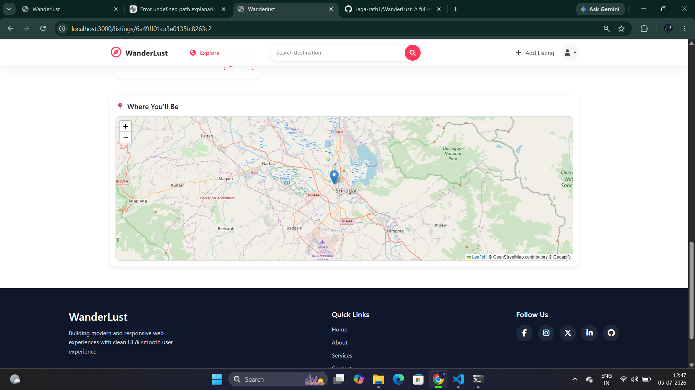

# 🌍 WanderLust

A full-stack travel accommodation booking web application inspired by Airbnb. WanderLust allows users to explore beautiful stays, create and manage property listings, upload images, and discover locations on an interactive map.

## ✨ Features

- 🔐 User Authentication & Authorization
- 🏠 Create, Edit & Delete Property Listings
- 📸 Image Upload using Cloudinary
- 🗺️ Location Search & Geocoding using Geoapify
- 📍 Interactive Maps for every listing
- 💬 Flash Messages for better user experience
- 🍪 Session-based Authentication
- ⭐ Responsive UI with Bootstrap
- 🛡️ Secure Route Protection
- 📱 Mobile Friendly Design

## 🛠️ Tech Stack

### Frontend
- HTML
- CSS
- Bootstrap
- EJS
- JavaScript

### Backend
- Node.js
- Express.js

### Database
- MongoDB
- Mongoose

### Services & APIs
- Cloudinary (Image Upload)
- Geoapify (Geocoding & Maps)

### Authentication
- Passport.js
- Express Session
- Connect Flash

---

# 📸 Screenshots

## Home Page


## Property Details


## Create Listing


## Interactive Map


## Login Page


## SignUp Page


## Review Page


---

## 🚀 Installation

```bash
git clone https://github.com/yourusername/wanderlust.git

cd wanderlust

npm install

npm start
```

---

## 🔑 Environment Variables

Create a `.env` file in the root directory and add:

```env
ATLASDB_URL=your_mongodb_connection_string

SECRET=your_session_secret

CLOUD_NAME=your_cloudinary_cloud_name
CLOUD_API_KEY=your_cloudinary_api_key
CLOUD_API_SECRET=your_cloudinary_api_secret

GEOAPIFY_API_KEY=your_geoapify_api_key
```

---

## 📌 Future Improvements

- ❤️ Wishlist Feature
- 💳 Online Payment Integration
- 🔍 Advanced Search & Filters
- 📅 Booking System
- 📧 Email Notifications

---

## 👨‍💻 Author

**Jagan Kumar Rath**

Built with ❤️ using Node.js, Express.js, MongoDB, Cloudinary and Geoapify.
